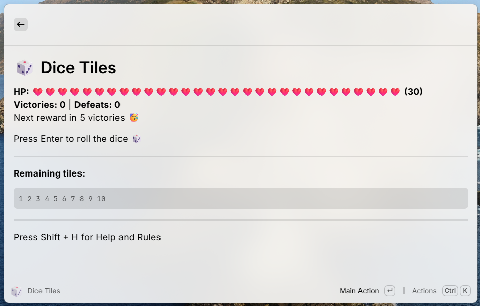

# Dice Tiles

🎲 Roll dice and eliminate numbered tiles by matching their sum. Track victories, unlock rewards, and reach higher tiers of accomplishment.

## Overview

Dice Tiles is a fun and challenging game you can play directly in [Raycast](https://www.raycast.com). Roll dice, select tiles to match the sum, and clear all tiles to win. Earn victories to unlock new rewards, see your life bar evolve, and reach higher achievement tiers.

## Gameplay

- Press **Enter** to roll the dice.  
- Select tiles that sum up to the dice roll.  
- Correct sum → tiles removed ✅  
- Wrong sum → lose HP ❌  
- HP 0 → Defeat 💀  
- Clear all tiles → Victory 🎉  

### Rewards

- Win victories to unlock new life emojis.  
- Milestone victories: 5, 10, 20, 40, 80, 160  
- At 500+ victories, the life bar shows a random pattern of celebratory emojis 🎇  

### Shortcuts

- **Shift + 1…0** → Select/Deselect tiles  
- **Enter** → Roll / Validate / Restart  
- **Shift + R** → Reset Game  
- **Shift + H** → Toggle Help  

## Installation

1. Install [Raycast](https://www.raycast.com) if you haven’t already.  
2. Clone this repository or download the extension.  
3. Open Raycast, go to **Extensions → Developer → Import Extension**, and select the folder.  

## Links

- [GitHub Repository](https://github.com/Jumitti/dice-tiles)  
- [Buy Me a Coffee ☕](https://www.buymeacoffee.com/yourusername)

## License

MIT License © Minniti Julien
